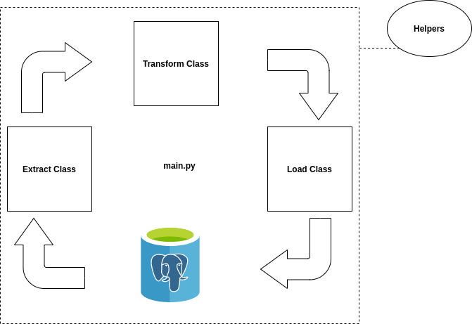
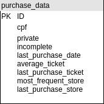

# ETL SERVICE - POC
ETL service (POC) based on python.

Project created to persist a chunk of data into the database. The ETL service is based on studies of ETL architectures and big data manipulations. 

***

## Quick Reference

  - [Requirements](#requirements).
  - [Installation](#installation).
  - [Execution](#execution).
  - [Application credentials](#application-credentials).
  - [Project Structure](#project-structure).
  - [Application Life-Cycle](#application-life-cycle).
  - [Database Structure](#database-structure).
  - [Reference Articles](#reference-articles).
  - [RoadMap (To-Do)](#roadmap-to-do).
  - [Footer note](#footer-note).

***

## Requirements

To run the application is required the following dependencies:

 - [Docker](https://docs.docker.com/);
 - [Docker compose](https://docs.docker.com/compose/);
 - [Preferred DB GUI (Dbeaver as optional)](https://dbeaver.io/download/);

 ***

 ## Installation

  1. Clone the application repository, running the following command:

  ```bash
    git clone https://github.com/ga0125/etl_service_poc.git # for HTTPS method

    # or
    
    git clone git@github.com:ga0125/etl_service_poc.git # for SSH method
  ```

  1. Change the project permissions (Optional):
  ```bash
    cd elt_service_poc/
    sudo chown -R $USER:$USER .
  ```

  *** 
  ## Execution

  1. Before to execute the commands below, change the name file from **example.env** to **.env**
  ```bash
    mv example.env .env # run this command into the root path project
  ```

  2. To build the application (Optional):
  ```bash
    docker build . -t <name-of-the-image> . # you can choose the build image name 
  ```
  3. To execute the ETL service via docker-compose:
  ```bash
    docker-compose up

    # or

    docker-compose up --build # run this command whether you've added any project's dependency
  ```

  4. To clear the volume data into the DB container:
  ```bash
    docker-compose down --volumes
  ```
  ***
 ## Application credentials

  With the ETL service application running, follow the database credentials access with your preferred DB GUI:

  - DB credentials:
    - **DB name** = db;
    - **DB user** = root;
    - **DB password** = localdev;
    - **DB host** = localhost;
    - **DB port** = 5432;
    - **DB local access url** =  http://localhost:5432
***

## Project Structure

```
  |-- etl_service_poc                 // base PATH
  |   |-- data
  |   |   └── test_base.txt           // txt/csv data to be filtered and persisted into the DB      
  |   |-- src
  |   |   |-- etl
  |   |   |   |-- extract_data.py     // script to extract data from file.
  |   |   |   |-- load_data.py        // script to tranform data before to persist.
  |   |   |   └── transform_data.py   // script to load data into the DB.
  |   |   |-- helpers
  |   |   |   |-- constants.py        // global constants values. 
  |   |   |   |-- exceptions.py       // global custom exceptions handlers.
  |   |   |   └── logging.py          // config logging system.
  |   |   |-- sql_commands       
  |   |   |   └── create_table.sql    // create table sql command.
  |   |   └── main.py                 // main etl service file.
  |   |-- .gitignore                  
  |   |-- docker-compose.yml
  |   |-- Dockerfile
  |   |-- example.env                // application environments variabels
  |   └── README.md                   
  └────── requirements.txt           // project dependencies.
  
```
***

## Application Life-cycle

The life-cycle application is based on ETL pattern. As you can check below, its a simple data-driven flow, but very effective and organized.



***

## Database Structure

The database structure is also a simple architecture, because we don't have any kind of relationships or foreign keys structure. Please, check below the ER diagram and the DB table structure:

- **ER diagram:**
  
  

- **DB table structure:**
 
Column               |     Type      | Description
-------------------- | ------------- | -------------------------------------
id                   | INTEGER       | Serial primary key
cpf                  | VARCHAR (11)  | CPF customer value.
private              | INTEGER       | Define whether is private or not.
incomplete           | INTEGER       | Define whether is incomplete or not.
last_purchase_date   | DATE          | Date value with YYYY-MM-DD format.  
average_ticket       | VARCHAR (8)   | Monetary value of average ticket
last_purchase_ticket | VARCHAR (8)   | Monetary value of last purchase ticket.
most_frequent_store  | VARCHAR (14)  | CNPJ store value.
last_purchase_store  | VARCHAR (14)  | CNPJ store value.

***

## Reference Articles

 - [Fastest Way to Load Data Into PostgreSQL Using Python](https://hakibenita.com/fast-load-data-python-postgresql);
 - [Dicas T-SQL – CPF: Qual tipo de dados devo utilizar? BIGINT ou CHAR?](https://luizlima.net/dicas-t-sql-cpf-qual-tipo-de-dados-devo-utilizar-bigint-ou-char/);
 - [What is ETL? (by Oracle)](https://www.oracle.com/integration/what-is-etl/);
 - [10 Tips to Improve ETL Performance](https://danischnider.wordpress.com/2017/07/23/10-tips-to-improve-etl-performance/);
***

## RoadMap (To-Do)

1. Add unit/integration tests on ETL classes;
2. Improve load-data process, following the steps of this [benchmark ](https://hakibenita.com/fast-load-data-python-postgresql);

***

## Footer note

I hope you enjoy the ETL service, and regardless of the completion of the future steps, I appreciate the opportunity where I could learn even more.